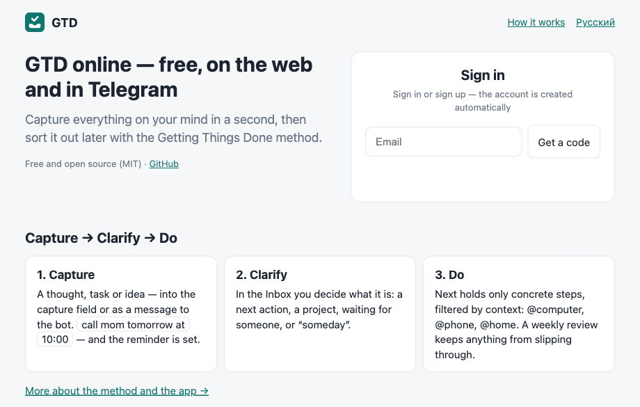
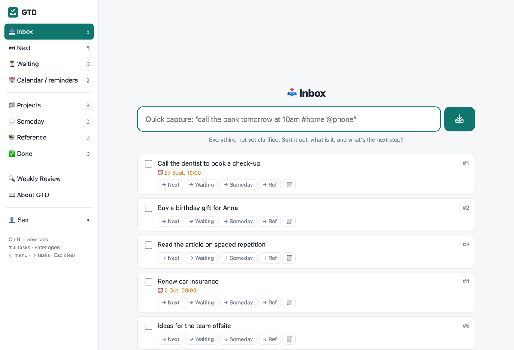
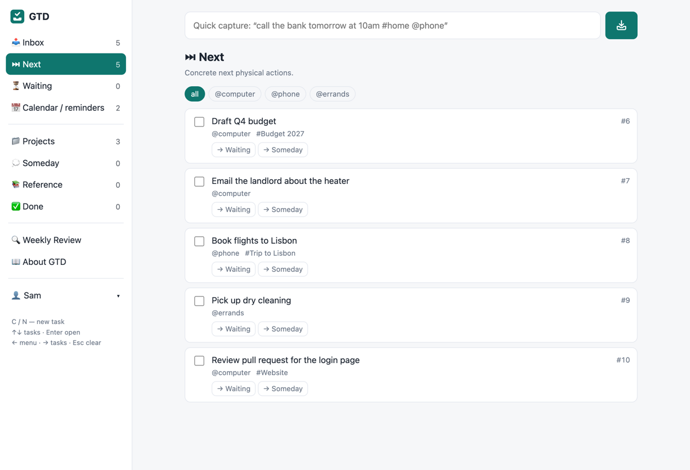

# GTD — free Getting Things Done app

A free task manager built around David Allen's GTD method: capture everything in a second, clarify it
later, do the next action. On the web and in Telegram, one account for both. Hosted at
**[gtd.serbito.rs](https://gtd.serbito.rs)** · bot [@gtdsrbot](https://t.me/gtdsrbot).

FastAPI + PostgreSQL, one container. English and Russian.







## Features

- **Quick capture** with natural dates: `call mom tomorrow at 10am #Family @phone` → task, reminder, project, context.
- **GTD lists:** Inbox · Next (filter by @context) · Waiting · Calendar/reminders · Projects (⚠ without a next
  action) · Someday · Reference · Done · Weekly Review.
- **Telegram bot:** send a message — it lands in the Inbox; reminders come with ✅ Done / 💤 +1h / ⏭ Next buttons.
- **Sign-in** by email code, Google or Telegram; methods link into one account, accounts can be merged.
- **Keyboard-first** web app, installable to the phone home screen.
- **Privacy:** analytics never include task content, emails or user ids.

Details for contributors: [docs/internals.md](docs/internals.md).

## Run locally

Once: `python3 -m venv .venv && .venv/bin/pip install -r requirements-dev.txt`, `cp .env.example .env`,
`createdb gtd`. Then — local database, auto-reload on every change:

```bash
.venv/bin/uvicorn app:app --reload --reload-exclude .venv --env-file .env
```

- `.env` points to the **local** database by default. The server applies the schema on startup, and
  unreleased code must not change production. Connecting to production is explicit only — see
  [docs/deploy-gcp.md](docs/deploy-gcp.md#database).
- `--reload-exclude .venv` is required: without it the watcher sees `.venv` and restarts the server in a loop.
- With `DEV=1` the sign-in screen has a **Dev login** button (first user), and without `SMTP_PASSWORD` the email
  sign-in code goes to the server log instead of an email.
- With `DEV=1` live reload works: editing `.py` restarts the server, editing `static/` doesn't, but either way
  the open page refreshes itself within ~1 s (it polls `/api/dev/version`). Text typed in the capture field is
  kept; an open task card postpones the refresh.
- Locally (http `BASE_URL`) the bot uses long polling and won't start if the bot has a production webhook.

Or with Docker: `DEV=1 docker compose up --build` — see [self-hosting](docs/self-host.md).

## Tests

```bash
.venv/bin/python -m pytest
```

A temporary database in the local Postgres (`brew services start postgresql@17`, or `TEST_PG_URL`) is created
and dropped automatically; Telegram, Google and email are stubbed. The release script runs them before tagging.

## Deploy

- **Your own server:** [docs/self-host.md](docs/self-host.md) — Docker Compose, app + Postgres, bot optional.
- **Reference instance** (Google Cloud Run, release by tag): [docs/deploy-gcp.md](docs/deploy-gcp.md).

## License

[MIT](LICENSE) © 2026 Alexander Bondarchuk — free to use, modify and distribute, including commercially,
as long as the copyright and license text are kept.

GTD® and Getting Things Done® are trademarks of the David Allen Company. This project is independent and not
affiliated with the author of the method.

## Other projects

Also by No Handoff:
- **Planning Poker** — free planning poker for scrum teams, no sign-up:
  [poker.serbito.rs](https://poker.serbito.rs/?utm_source=github&utm_medium=crosspromo&utm_campaign=readme) ·
  [GitHub](https://github.com/alxndr-bnd/planning-poker)
- **Javi** — delivery notifications for small businesses in Serbia:
  [javi.serbito.rs](https://javi.serbito.rs/?utm_source=github&utm_medium=crosspromo&utm_campaign=readme) ·
  [GitHub](https://github.com/alxndr-bnd/javi)
- **Serbito** — classifieds in Serbia:
  [serbito.rs](https://serbito.rs/?utm_source=github&utm_medium=crosspromo&utm_campaign=readme)

Made by [No Handoff](https://www.linkedin.com/company/nohandoff/)
