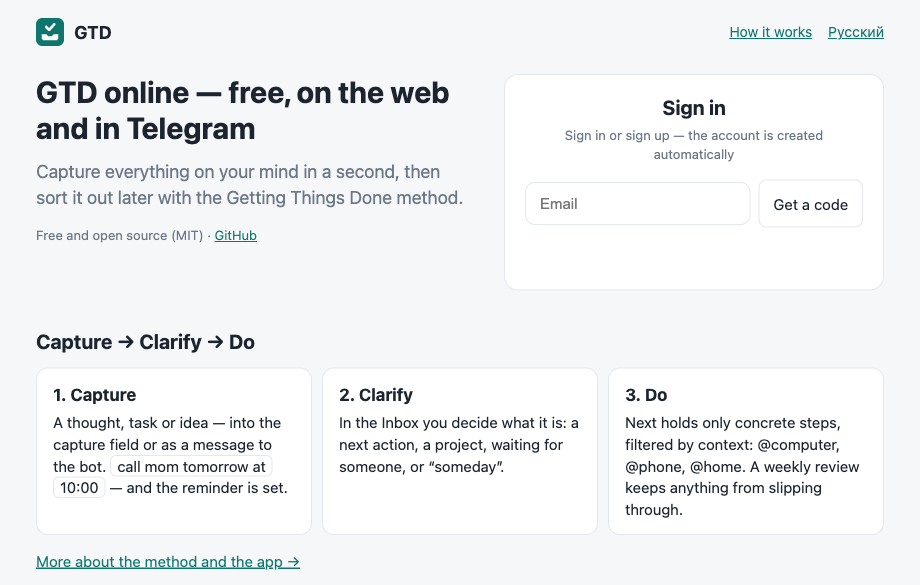
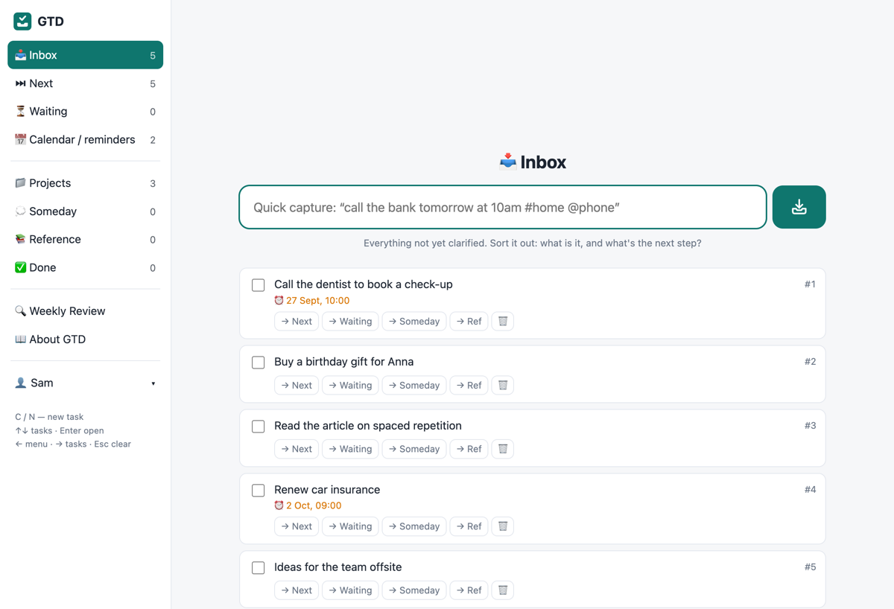
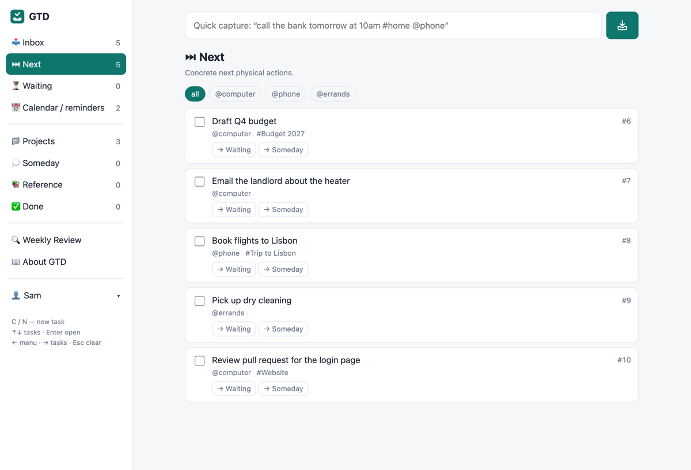

# GTD — free Getting Things Done app

A free task manager built around David Allen's GTD method: capture everything in a second, clarify it
later, do the next action. On the web and in Telegram, one account for both. Hosted at
**[gtd.serbito.rs](https://gtd.serbito.rs)** · bot [@gtdsrbot](https://t.me/gtdsrbot).

FastAPI + PostgreSQL, one container. English and Russian.







## Features

- **Quick capture** with natural dates: `call mom tomorrow at 10am #Family @phone` → task, reminder, project, context.
- **GTD lists:** Inbox · Next (filter by @context) · Waiting · Calendar/reminders · Projects (⚠ without a next
  action) · Someday · Reference · Done · Weekly Review.
- **Telegram bot:** send a message — it lands in the Inbox; reminders come with ✅ Done / 💤 +1h / ⏭ Next buttons.
- **Sign-in** by email code, Google or Telegram; methods link into one account, accounts can be merged.
- **AI assistants:** connect Claude, ChatGPT, Cursor or VS Code with sign-in (OAuth, no token), or any MCP client
  with a personal token — see [Connect Claude](#connect-claude-mcp).
- **Keyboard-first** web app, installable to the phone home screen.
- **Privacy:** analytics never include task content, emails or user ids.

Details for contributors: [docs/internals.md](docs/internals.md). What changed in each version:
[CHANGELOG.md](CHANGELOG.md) (also on the site: [What's new](https://gtd.serbito.rs/en/changes)).

## Connect Claude (MCP)

Claude and other MCP clients can work with your tasks: capture to the Inbox, list and search tasks, projects and
contexts, complete and edit a task, move it to another list, project or context, and run the Weekly Review.
The server address is `https://gtd.serbito.rs/mcp` (on your own server — `BASE_URL/mcp`).

### claude.ai, Claude Desktop and the Claude mobile app — a custom connector (OAuth)

You need only the address. No token.

1. In Claude, open **Settings → Connectors → Add custom connector**.
2. Enter a name (for example, `GTD`) and the URL `https://gtd.serbito.rs/mcp`. Leave the OAuth fields empty.
   Press **Add**, then **Connect**.
3. GTD opens. Sign in (Google, email or Telegram) if you are not signed in. Check the app name and the return
   address (`claude.ai`), then press **Allow**.
4. Claude returns to the chat with the connector on. A connector added on claude.ai also works in Claude Desktop
   and on the phone.

### ChatGPT, Cursor, VS Code and other clients — sign in (OAuth)

Any MCP client with OAuth sign-in works the same way: give it the address, sign in to GTD, and press **Allow**.

- **ChatGPT:** turn on **Developer mode** in the settings, then add an app (connector) with the URL
  `https://gtd.serbito.rs/mcp` and OAuth authentication.
- **Cursor:** add the server to `~/.cursor/mcp.json`, then press **Connect** next to it in **Cursor Settings → MCP**:
  ```json
  { "mcpServers": { "gtd": { "url": "https://gtd.serbito.rs/mcp" } } }
  ```
- **VS Code:** run **MCP: Add Server…**, choose **HTTP**, and enter the URL. Or add it to `.vscode/mcp.json`:
  ```json
  { "servers": { "gtd": { "type": "http", "url": "https://gtd.serbito.rs/mcp" } } }
  ```
- **Claude Code:** `claude mcp add --transport http gtd https://gtd.serbito.rs/mcp`, then run `/mcp` and choose
  **Authenticate**.

**Check the consent screen.** The app sends its own name, and GTD does not check it. The screen also shows where the
access goes: a site (`chatgpt.com`), an app on this computer (`localhost`), or a desktop app (`cursor://…`). If you
did not start the connection yourself, or you do not know that address, press **Deny**.

GTD accepts these return addresses: any `https://` site, `http://localhost`, `127.0.0.1` or `[::1]` on any port,
and the app links `cursor://`, `vscode://` and `vscode-insiders://`.

To disconnect, open **👤 Account → 🤖 AI assistants → Connected apps** and press **Disconnect**. Access stops at
once. Removing the connector in the client may leave access open in GTD; disconnect it in GTD too.

### Any client — a personal token

1. In the app, open **👤 Account → 🤖 AI assistants (MCP)**. Enter a token name and press **Create token**.
   Copy the token at once: the app shows it only once.
2. Connect the client.
   - **Claude Code:** the app shows this command with your token filled in:
     ```bash
     claude mcp add --transport http gtd https://gtd.serbito.rs/mcp --header "Authorization: Bearer gtd_…"
     ```
   - **Other clients** with remote MCP servers: transport “Streamable HTTP”, the address above, and the header
     `Authorization: Bearer gtd_…`.
   - **Clients that start only local servers:** use the `mcp-remote` bridge — command `npx`, arguments
     `["mcp-remote", "https://gtd.serbito.rs/mcp", "--header", "Authorization: Bearer gtd_…"]`.

### What Claude can do

Ask, for example: “add ‘call the bank tomorrow 10am’ to my inbox”, “what are my next actions @phone?”,
“complete #42”, “move #17 to the Renovation project”, “#12 is waiting for Anna”, “let's do the weekly review”.

| Tool | What it does |
| --- | --- |
| `capture` | Captures a task, like the app and the bot: dates, `#Project` and `@context` in the text work |
| `list_tasks` | Lists a list (Inbox, Next, Waiting, Scheduled, Someday, Reference, Done, all); filters by project, context, text |
| `list_projects` | Active projects with counts; marks projects without a next action |
| `list_contexts` | Contexts with counts of open tasks |
| `complete_task` | Marks task #N done |
| `move_task` | Moves task #N to a list, a project (created if missing) and/or a context |
| `update_task` | Changes the title, notes or due date of task #N, or sets who it waits for (moves it to Waiting) |
| `weekly_review` | Read-only summary: Inbox count, projects without a next action, overdue, Waiting, next 7 days, Someday count |

### Security

- A token or a connected app opens every task of its account, and nothing of other accounts.
- The database keeps only SHA-256 hashes of tokens. OAuth access tokens live 1 hour; refresh tokens live 90 days
  and change on every use. A reused refresh token or code disconnects the app.
- OAuth returns only to Claude's callback (`https://claude.ai/api/mcp/auth_callback`, the same on `claude.com`) or
  to a program on your computer (`http://localhost`, `127.0.0.1`, `[::1]`), exact match.
- “👤 Account” shows when each token and app was last used. **Revoke** and **Disconnect** cut access at once.
  “Sign out on all devices” does not revoke tokens or apps. The limit is 120 requests a minute per token or app.

## Run locally

Once: `python3 -m venv .venv && .venv/bin/pip install -r requirements-dev.txt`, `cp .env.example .env`,
`createdb gtd`. Then — local database, auto-reload on every change:

```bash
.venv/bin/uvicorn app:app --reload --reload-exclude .venv --env-file .env
```

- `.env` points to the **local** database by default. The server applies the schema on startup, and
  unreleased code must not change production. Connecting to production is explicit only — see
  [docs/deploy-gcp.md](docs/deploy-gcp.md#database).
- `--reload-exclude .venv` is required: without it the watcher sees `.venv` and restarts the server in a loop.
- With `DEV=1` the sign-in screen has a **Dev login** button (first user), and without `SMTP_PASSWORD` the email
  sign-in code goes to the server log instead of an email.
- With `DEV=1` live reload works: editing `.py` restarts the server, editing `static/` doesn't, but either way
  the open page refreshes itself within ~1 s (it polls `/api/dev/version`). Text typed in the capture field is
  kept; an open task card postpones the refresh.
- Locally (http `BASE_URL`) the bot uses long polling and won't start if the bot has a production webhook.

Or with Docker: `DEV=1 docker compose up --build` — see [self-hosting](docs/self-host.md).

## Tests

```bash
.venv/bin/playwright install chromium   # once: the browser for the SPA smoke test
.venv/bin/python -m pytest
```

A temporary database in the local Postgres (`brew services start postgresql@17`, or `TEST_PG_URL`) is created
and dropped automatically; Telegram, Google and email are stubbed. `tests/test_browser_smoke.py` opens every
section of the app and the public pages in headless Chromium and fails on any JS error. The release script runs
the tests before tagging.

CI ([`.github/workflows/ci.yml`](.github/workflows/ci.yml)) runs on every pull request and every push to `main`:
the full pytest with the browser smoke, a lock check and an image build.

## Dependencies

Versions are locked with hashes. You edit `requirements*.in`; `requirements*.txt` are generated, do not edit them.

| File | What | Installed by |
|---|---|---|
| `requirements.in` → `requirements.txt` | app dependencies | the Docker image (`pip install --require-hashes`) |
| `requirements-dev.in` → `requirements-dev.txt` | the same versions plus pytest and Playwright | developers and CI |

Update the lock with [uv](https://docs.astral.sh/uv/) (`brew install uv`), then reinstall and commit `.in` and `.txt` together:

```bash
scripts/lock.sh                            # after an edit in requirements*.in
scripts/lock.sh --upgrade-package fastapi  # one package to its latest version
scripts/lock.sh --upgrade                  # all packages
.venv/bin/pip install -r requirements-dev.txt
```

- CI fails if the lock does not match `requirements*.in`.
- Dependabot opens weekly PRs for the lock (ecosystem `uv`), the base image digest and the actions.
- The base image is pinned as `python:3.14-slim@sha256:…`. Dependabot bumps the digest. The deploy still runs
  `apt-get upgrade` once a day, so Debian security fixes do not wait for a new digest. A new Python minor version
  is a manual change: the `FROM` tag and `--python-version` in `scripts/lock.sh`.

## Releasing

1. With every user-facing change, add a line under `## [Unreleased]` in [CHANGELOG.md](CHANGELOG.md):
   `### Added` / `Changed` / `Fixed` / `Security`, one line `- English text` and right under it
   `  - RU: Русский текст`. Write what users can now do or what got fixed — not commit messages.
2. On `main`: `scripts/release_minor.sh "Commit message" [new_file …]`. It picks the next tag `vX.Y.0` and
   **refuses to release** if `[Unreleased]` has no entries. Otherwise it renames `[Unreleased]` to
   `## [X.Y.0] - <today>` (with a fresh empty `[Unreleased]` on top), runs the tests, commits everything
   in one release commit, tags, pushes, and creates the GitHub Release with that version's English entries.
3. The tag deploys ([docs/deploy-gcp.md](docs/deploy-gcp.md)) with `APP_VERSION` from the tag: the footer,
   the app menu and `/changes` show it (`dev` when unset, e.g. locally).
4. The deploy fails for a tag without its `## [X.Y.Z]` section in CHANGELOG.md, so a tag pushed by hand
   cannot ship without notes.
5. Weekly OS refresh (SERBITO-401): every Wednesday 03:00 UTC (or *Run workflow*) the deploy rebuilds the newest
   `vX.Y.Z` tag with fresh Debian packages and redeploys it: same version, image `<sha>-r<YYYYMMDD>`. Trivy gates it
   like a release; if the main page is not 200 after the switch, traffic goes back to the previous revision.

`/changes` and `/en/changes` render CHANGELOG.md, parsed once at startup by `changelog.py`;
`tests/test_changelog.py` checks the format, both languages and that every tag has an entry.

## Deploy

- **Your own server:** [docs/self-host.md](docs/self-host.md) — Docker Compose, app + Postgres, bot optional.
- **Reference instance** (Google Cloud Run, release by tag): [docs/deploy-gcp.md](docs/deploy-gcp.md).

## License

[MIT](LICENSE) © 2026 Alexander Bondarchuk — free to use, modify and distribute, including commercially,
as long as the copyright and license text are kept.

GTD® and Getting Things Done® are trademarks of the David Allen Company. This project is independent and not
affiliated with the author of the method.

## Other projects

Also by No Handoff:
- **Planning Poker** — free planning poker for scrum teams, no sign-up:
  [poker.serbito.rs](https://poker.serbito.rs/?utm_source=github&utm_medium=crosspromo&utm_campaign=readme) ·
  [GitHub](https://github.com/alxndr-bnd/planning-poker)
- **Javi** — delivery notifications for small businesses in Serbia:
  [javi.serbito.rs](https://javi.serbito.rs/?utm_source=github&utm_medium=crosspromo&utm_campaign=readme) ·
  [GitHub](https://github.com/alxndr-bnd/javi)
- **Serbito** — classifieds in Serbia:
  [serbito.rs](https://serbito.rs/?utm_source=github&utm_medium=crosspromo&utm_campaign=readme)

Made by [No Handoff](https://www.linkedin.com/company/nohandoff/)
